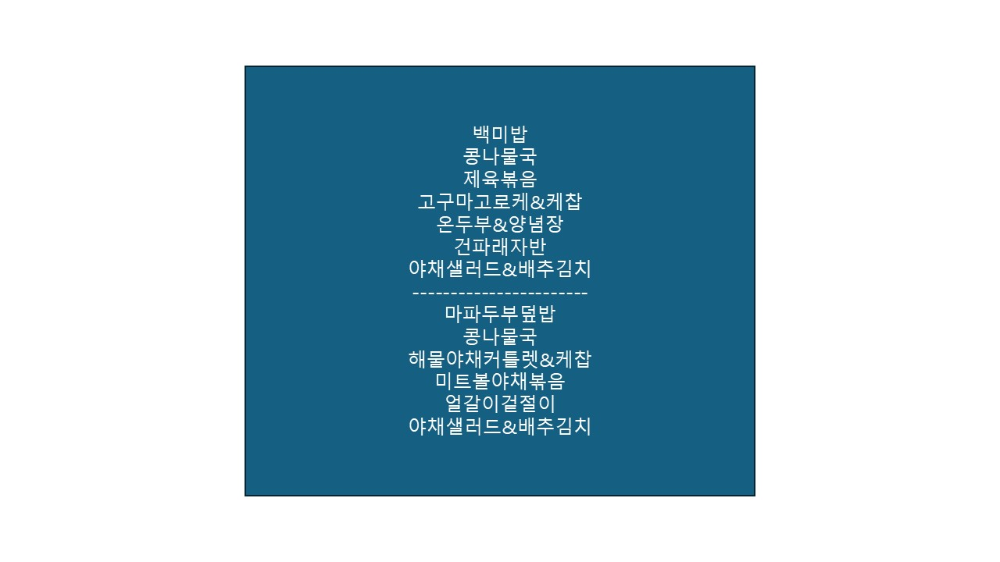

Hongik Lunch
===

**This project is Vibe Coded. Only God and Gemini knows how this works.**

비주얼베이직 매크로로 파워포인트 상자에 오늘 점심을 기입합니다.

## Howto

### 1. Setup
*뭐가 많은데 한 번만 설정해두면 매크로 딸깍으로 메뉴만 바꿀 수 있습니다.*

VBA 에디터(Alt + F11) -> 도구 -> 참조에서 체크

- [ ] Microsoft WinHTTP Services, version 5.1

- [ ] Microsoft ActiveX Data Objects 6.1 Library

### 2. 매크로
VBAProject에 우클릭 -> 삽입 -> 모듈 

코드 복붙

### 3. 상자
상자 그리기

홈 -> 선택 -> 선택 창 으로 상자 선택

이름 **MenuBox** 로 설정

### 4. 실행

앞에 해두면 다음부터는 이 부분만 하면 됩니다!

Alt+F8 -> UpdateMenu -> 실행(Alt+R)

## Others
아침 저녁은 [링크](https://www.hongik.ac.kr/kr/life/seoul-cafeteria-view.do?articleNo=5414&restNo=3) 타고가서 봅시다.

점심 두 개 나오는거 바뀌면 이것도 바뀌어야 할텐데 내 탈홍이 더 빨랐으면 좋겠다.

파워포인트로 바탕화면 만들어 써서 만들어봤습니다.

공부하기 싫을 때 그것도 올릴게요.